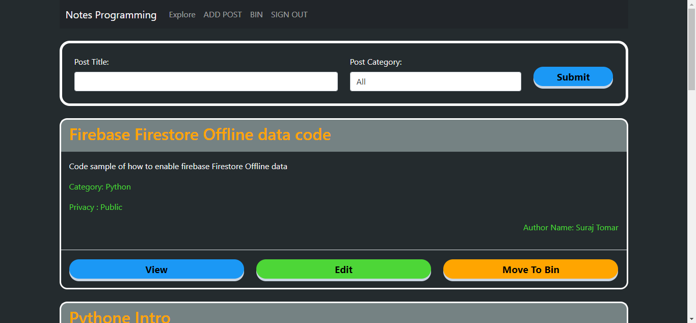
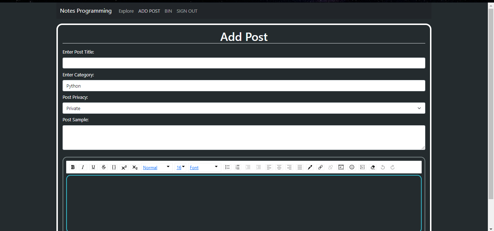
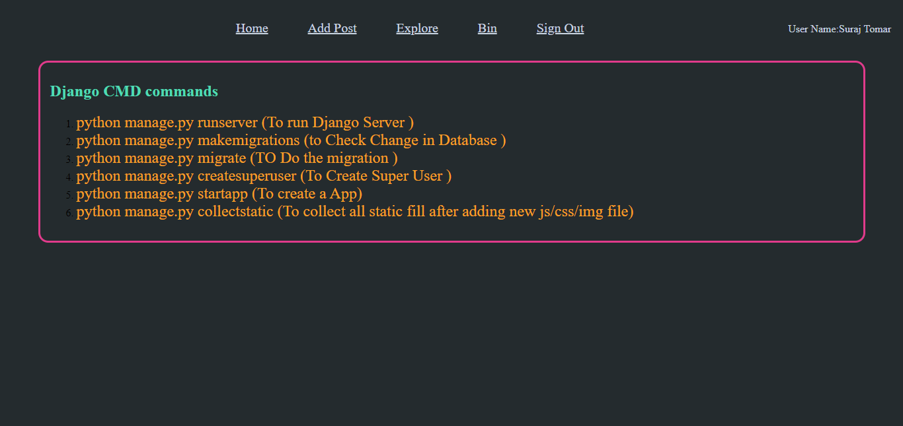
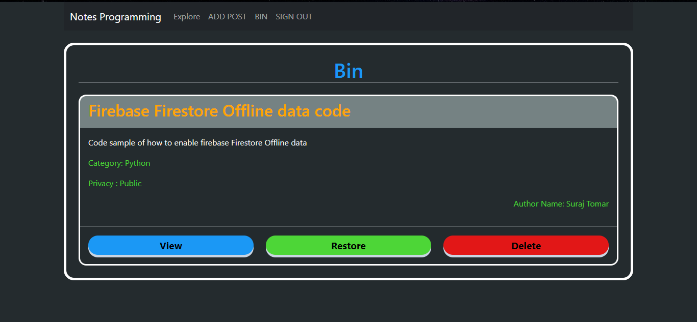
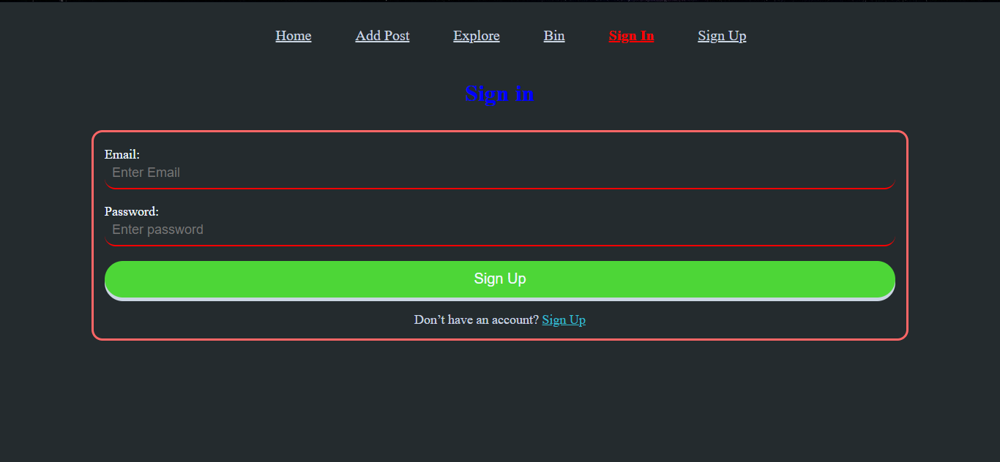
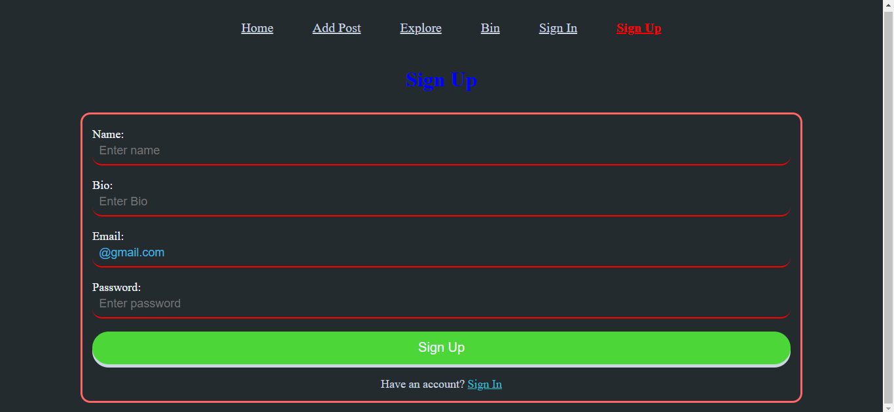

# programming-notes

A website to take down notes

# Running this project

To get this project up and running you should start by having Node js installed on your computer.

```
npm install
```

Go to firebase console and make a project and copy firebase config in config file in src dir

```
npm start
```

# Screenshots

### Home page



### Add Post page



### View Post page



### Bin page



### Sing In page



### Sign Up page



---

## About this Project

This project is part of list of project that i make during learning React JS.
